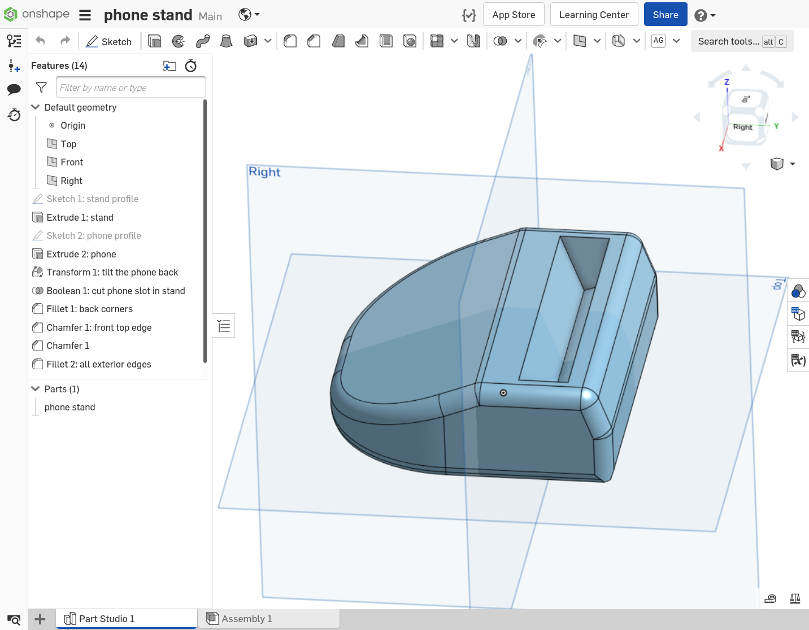

# Class: Introduction to 3D CAD modeling with OnShape

- [Class: Introduction to 3D CAD modeling with OnShape](#class-introduction-to-3d-cad-modeling-with-onshape)
- [class overview](#class-overview)
  - [audience](#audience)
  - [before-class setup](#before-class-setup)
  - [in this class we will](#in-this-class-we-will)
- [helpful links](#helpful-links)
- [OnShape vs OpenSCAD](#onshape-vs-openscad)
  - [OpenSCAD](#openscad)
  - [OnShape](#onshape)
  - [side note: `.stl` vs `.step`](#side-note-stl-vs-step)
    - [`.stl`](#stl)
    - [`.step`](#step)
- [UI overview](#ui-overview)
- [general design workflow](#general-design-workflow)
- [design activity: custom phone stand](#design-activity-custom-phone-stand)
  - [you will need](#you-will-need)
  - [outer profile of the phone stand](#outer-profile-of-the-phone-stand)
  - [extrude the phone stand](#extrude-the-phone-stand)
  - [now make the phone itself](#now-make-the-phone-itself)
  - [tilt the phone back a little](#tilt-the-phone-back-a-little)
  - [cut out the phone from the phone stand](#cut-out-the-phone-from-the-phone-stand)
  - [go back and tweak the dimensions if anything doesn't look right](#go-back-and-tweak-the-dimensions-if-anything-doesnt-look-right)
  - [add fillets and chamfers to make it look good](#add-fillets-and-chamfers-to-make-it-look-good)

# class overview
This page is class notes for teaching a class on how to use OnShape CAD to make 3D objects, for the intended application of 3D printing.

## audience
* programmers and non-programmers alike (OnShape is unrelated to programming, just to be clear)
* people interested in 3D printing or other uses for CAD

## before-class setup
(if you cannot do the setup, you'll just have to watch)
* OnShape account (see [helpful links](#helpful-links) section)
  * please have this account ready before class
* a personal device that can use the OnShape account
  * a recent version of firefox or chrome (on any OS) is probably all you need
  * a real mouse (not a laptop touchpad) is a huge plus, in terms of user-experience
* phone (or similarly-sized object to put in the stand)
* ruler to measure phone (metric is preferable, millimeters is best)

## in this class we will
* briefly discuss OnShape vs OpenSCAD
* familiarize ourselves with OnShape concepts and typical design workflow
* practice CAD design by designing a custom stand for a phone (or similarly-sized object)

# helpful links
*  get a free OnShape account
  * OnShape free account for hobbyists (non-commercial): https://www.onshape.com/en/products/free
  * (you might need to turn off adblock for that link to work, for some reason)
  * NOTE: a free account cannot make private designs, only public ones. (just like github used to be)
* [Isaac Good](https://isaacgood.com/hackerlab/)'s [**discord instructions**](https://docs.google.com/document/d/e/2PACX-1vTruRIsJ4FDq1X8GJILeOs0qOJIedwmP119POkkqrCD8JVHfvzLJHyY8tWPqmtgUHmiYPLK63hbUHSI/pub)
* Pre-done phone stand (that we will be designing in this course): [OnShape document](https://cad.onshape.com/documents/147a6a5828b80086666db3cd/w/4d92c19146fffeff7bfe8b63/e/310085034febe73b120244a2)
* [OnShape manual](https://cad.onshape.com/help/Content/EnterpriseHelp/Content/EnterpriseLandingPage.htm)
* OnShape keyboard shortcuts: [manual page](https://cad.onshape.com/help/Content/shortcut_keys.htm), [blog article](https://www.onshape.com/en/resource-center/tech-tips/tech-tip-keyboard-shortcuts)

# OnShape vs OpenSCAD
They are very different things. Although they can be used to solve many of the same problems, a direct comparison to them is unfair.

## OpenSCAD
* open source
* based on a programming language
* primarily uses Constructive Solid Geometry operations (add, subtract, intersect...) and 3D transformations (translate, rotate, scale...) on 3D primitives (sphere, cylinder, cube, etc)
* exports to various file formats for 3D printing or graphics rendering

## OnShape
* closed-source, proprietary `:(`
  * comparable to other CAD software like Fusion360, AutoCAD, SolidWorks, etc
* cloud-based and fully in-browser
  * most of the comparable alternatives listed above are not in-browser, but do have some cloud-based components
* interactive, WYSIWYG (what you see is what you get)
* exports to common CAD file formats (compatible with CAD programs mentioned above), industry-standard `.step` files, and some formats suitable for 3D printing (such as `.stl`)

## side note: `.stl` vs `.step`

### `.stl`
* just a mesh of triangles
  * all of the intended geometry (circles, planes, curves, corners, etc) has been turned into many thousands of triangles
* pro: understood by 3D printing slicer software
  * modern computers (especially GPUs) are really good at triangles
* con: very difficult to edit
  * converting the triangles back to proper shapes (circles, planes, curves, etc) is not easy

### `.step`
* stands for “Standard for the Exchange of Product model data”
* pro: easy to edit because it preserves the originally-designed geometry (circles are still circles)
* con: not understood by most 3D printing slicer software (currently)

# UI overview

(`O` indicates out of scope of this class)
* in the middle: that's the model that we are designing
* the `X Y Z` box in the top-right corner: [the "View Cube"](https://cad.onshape.com/help/Content/moving.htm)
  * click a face of the View Cube to rotate the design accordingly
* left side:
  * history view: displays all the steps in your design
    * `O` steps can be renamed, organized into folders, rolled back, and more
  * also shows all the parts in the design (with per-part visibility toggle button)
  * `O` also apparently document history/revision control and comments and system performance monitor is on the far-left bar there too
* top bar
  * in the 3D view: displays available 3D operations (sketch, extrude, etc)
  * in a sketch (not pictured): same, but for 2D operations (line, rectangle, circle, etc)
* right side: `O` various stuff for parametric design and configuration management
* bottom bar: `O` parts and assemblies in the current document

# general design workflow
This is what tends to work well for me, and (as far as I know) is how OnShape and similar CAD software is intended to be used.

* `Alt-C` keyboard shortcut brings up a search box where you can search for functions (very useful)
* there's a keyboard shortcuts cheat sheet in the `?` help menu at the top right (also mentioned in the [helpful links](#helpful-links) section)

* usually you will start 2D (with a sketch) and then go 3D (with an extrude or revolve or something)
  * there are functions that can change existing 3D objects, but (unlike OpenSCAD), it is very uncommon to go directly to a 3D object.
  * E.g. there isn't a "make a cube" function, instead you would make a square in a sketch and extrude it into a cube

* if you go back and change something in a previous step, it will automatically recalculate the rest of the stuff so it is updated
  * or it might fail to do this, in which case, `Ctrl-Z` to undo lol
  * Also, for many functions, there is a `Final` button you can click switch from looking at what you're currently editing to looking at the final product (after all the subsequent changes are applied). This is useful when e.g. you want to tweak a dimension until the final product "looks about right"

* when your design needs to interface with a real-world object, it is often helpful to first model the existing real-world object in CAD and go from there
  * (keep an eye out for when we do this in the in-class activity!)

# design activity: custom phone stand
(this is to be demoed in-class, and hopefully participants can follow along with their own devices)

We're going to make a phone stand that's perfectly sized for your phone (plus whatever case is on it).
Next time you're in the TS hackerlab, you can even 3D print it! (or you can print it immediately, if you happen to have a 3D printer)

## you will need
* OnShape account (see above)
  * it's probably best to have this ready before class
* phone (or similarly-sized object to put in the stand)
* ruler to measure phone (metric is preferable, millimeters is best)

## outer profile of the phone stand
* sketch on right face
* rectangle for the front
* slanted part for the back

## extrude the phone stand
* change `Blind` to `Symmetric` so that the stand stays in the middle of the work area (this will make things easier later)
* `Depth` should be width of phone plus a margin on either side
  * for my 80mm phone I did 100mm

## now make the phone itself
* mostly the same procedure as for the phone stand
* hide the phone stand so it's not in the way while you do this
* position the phone roughly where it should sit inside the stand
  * don't worry about tilting it back, we'll do that later
  * re-show the phone stand profile sketch (probably "Sketch 1") to make this easier
* extrude the phone as a **new** part, not as an addition to the existing thing
  * also, make it symmetric

## tilt the phone back a little
* use `Transform` function to do this
  * select the phone part to transform
  * select `Rotate` from the drop-down
  * select one of the bottom edges of the phone part as the axis
* pick a good angle
  * probably like 10-40 degrees or so
  * if the angle is going the wrong direction, click the arrow next to it to reverse it

## cut out the phone from the phone stand
* use `Boolean` to do this
  * select `Subtract` tab
  * tool is the phone (the part that defines what shape we are cutting out)
  * target is the phone stand (what's going to be left when we are done)
* this will delete the phone part. If you want to keep that (e.g. so your CAD model looks more realistic), check the `keep tools` box

## go back and tweak the dimensions if anything doesn't look right
* if you go back and change something in a previous step, it will automatically recalculate the rest of the stuff so it is updated
  * or it might fail to do this, in which case, `Ctrl-Z` to undo lol

## add fillets and chamfers to make it look good
* fillet: rounded corner
* chamfer: cut off corner that is not rounded
* fillets look great in CAD pretty much everywhere
* but for 3D printing, you want to avoid fillets:
  * on the bottom edges (will mess up build plate adhesion)
  * on the top edges (won't look very good due to print resolution)
  * chamfers are good in these locations though

