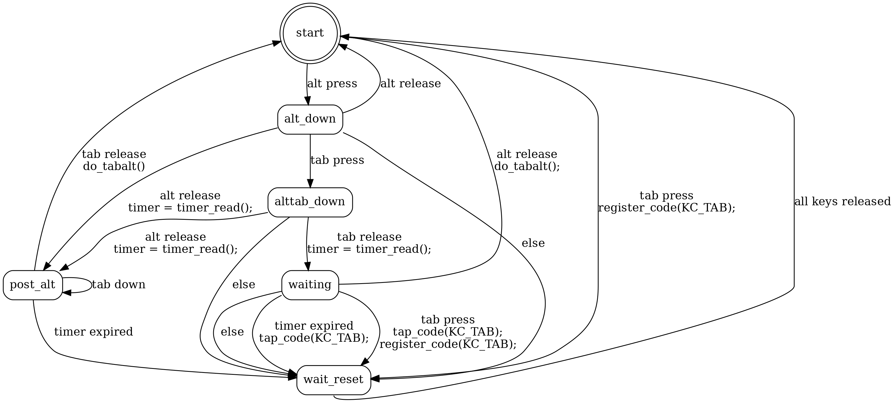

# WinXP-style Alt-Tab

- [WinXP-style Alt-Tab](#winxp-style-alt-tab)
- [problem](#problem)
  - [side note: yes, this is a real intentional feature that gnome 3 has and windows 10 does not have](#side-note-yes-this-is-a-real-intentional-feature-that-gnome-3-has-and-windows-10-does-not-have)
- [potential solution: WinXP-style Alt-Tab](#potential-solution-winxp-style-alt-tab)
  - [problem: too hard to type](#problem-too-hard-to-type)
  - [another problem: the switched-away-from app receives an alt tap](#another-problem-the-switched-away-from-app-receives-an-alt-tap)
- [alternative solution: regedit](#alternative-solution-regedit)
- [better solution: delay alt-tab](#better-solution-delay-alt-tab)
  - [update 2021.11.27](#update-20211127)


# problem

Windows 7 and above ship an alt-tab menu that shows thumbnails of open applications.

The problem with this is
* the size of the alt-tab menu is quite large
* the alt-tab UI renders immediately
  * (in contrast to most linux environments, where the UI waits a second to render. This allows it to not render at all, and instead switch windows immediately, if the `alt` is released inside the timeout.)

Thus, when switching between applications frequently (e.g. with two windows tiled side-by-side), the alt-tab UI menu is constantly flickering in and out of existence. This causes headaches for some people (myself included)


## side note: yes, this is a real intentional feature that gnome 3 has and windows 10 does not have
Here's the relavent snippet of code 
```javascript
// We delay showing the popup so that fast Alt+Tab users aren't
// disturbed by the popup briefly flashing.
this._initialDelayTimeoutId = GLib.timeout_add(
    GLib.PRIORITY_DEFAULT,
    POPUP_DELAY_TIMEOUT,
    () => {
        this._showImmediately();
        return GLib.SOURCE_REMOVE;
    });
GLib.Source.set_name_by_id(this._initialDelayTimeoutId, '[gnome-shell] Main.osdWindow.cancel');
```
this excerpt is from `gnome-shell` source file `js/ui/switcherPopup.js`, 
[gitlab source permalink here](https://gitlab.gnome.org/GNOME/gnome-shell/-/blob/a21058e6c9008bb6145e6c8e48e3c2f5452e68e8/js/ui/switcherPopup.js#L139)


# potential solution: WinXP-style Alt-Tab

There is a secret keyboard shortcut that activates a much smaller and simpler alt-tab menu:

> To trigger the old XP style one, you’ll need to do the following:
> 
>  * Hold down the Left (or Right) Alt key.
>  * Press and release the other Alt key.
>  * Keep holding down that first Alt key, and then press Tab.
> 
> And Voila! The ugly old XP-style one will show up.

reference: [Stupid Geek Tricks: Windows 7 Easter Egg Shows the XP Alt-Tab Prompt](https://www.howtogeek.com/howto/5200/stupid-geek-tricks-windows-7-easter-egg-shows-the-xp-alt-tab-prompt/)

## problem: too hard to type
This keyboard shortcut is a huge pain to type. Two hands just to alt-tab!?! No thank you!!!

**solution:** use a QMK keyboard macro to tap the other alt key:

```c
enum custom_keycodes {
    TABALT = SAFE_RANGE,
};
bool process_record_user(uint16_t keycode, keyrecord_t *record) {
    switch (keycode) {
    case TABALT:
        if (record->event.pressed) {
            if ((get_mods() == MOD_BIT(KC_LALT))) {
                tap_code(KC_RALT);
            }
            register_code(KC_TAB);
        } else {
            unregister_code(KC_TAB);
        }
        break;
    }
    return true;
};

// and then replace KC_TAB with TABALT in layout definition
```

See [my full keyboard layout file](https://github.com/madewithlinux/qmk_firmware/blob/0138aa9da881dc3b4ee76a510b8fe2727a865292/keyboards/kbdfans/kbd75/keymaps/madewithlinux/keymap.c) for full implementation, including a function key to toggle it on and off, and using part of my keyboard's RGB underglow as an indicator.


## another problem: the switched-away-from app receives an alt tap

In many apps (chrome, firefox, vscode, etc), pressing and releasing the alt key moves the keyboard focus to some kind of menu.
Thus, with the above keyboard-macro-based mitigation, switching between windows could cause menus to focus undesirably.

I don't have a solution for this yet.


# alternative solution: regedit

reference: [Stupid Geek Tricks: How to Switch Windows 7 to the XP Style Alt-Tab Switcher](https://www.howtogeek.com/howto/28344/stupid-geek-tricks-how-to-switch-windows-7-to-the-xp-style-alt-tab-switcher/)

pros:

* no "alt tap" issue (as described above)

cons:

* cannot easily switch back to the regular switcher (the thumbnails are sometimes convenient to have)
* regedit `:/`


# better solution: delay alt-tab

This is based much more directly on the way that gnome-shell does it (see above).

The idea is relatively simple: buffer the tab part of the alt-tab for a timeout interval, instead of sending a tab keycode immediately. Then:

* If the alt key is released before the timeout expires, send a quick WinXP-style alt-tab key sequence. Sending this all at once seems to be fast enough to switch windows withot any UI flashing
* if the timeout expires, or any other key is pressed, continue with alt-tab as normal

The state machine kind of logic necessary to implement this turned out to be much more complicated than I expected!
I think I've got it totally working now (but technically it doesn't do the "any key" part above, just tab).
The code is [here](https://github.com/madewithlinux/qmk_firmware/blob/8ab082c6ebd31fb23301eebca1fd4b7963271050/keyboards/kbdfans/kbd75/keymaps/madewithlinux/keymap.c#L18), and includes a pseudocode-ish summary of the intent.


## update 2021.11.27
I rewrote the delayed-alt-tab logic. It now uses this finite-state-machine:



and also, it now waits 10ms after tapping right alt before tapping tab and releasing left alt. This seems to be much more consistent.

The updated keyboard layout/firmware (and source for that FSM diagram) is [here](https://github.com/madewithlinux/qmk_firmware/tree/3512cb673a4ebe26e63a008357d04fde95876cd2/keyboards/kbdfans/kbd75/keymaps/madewithlinux)

